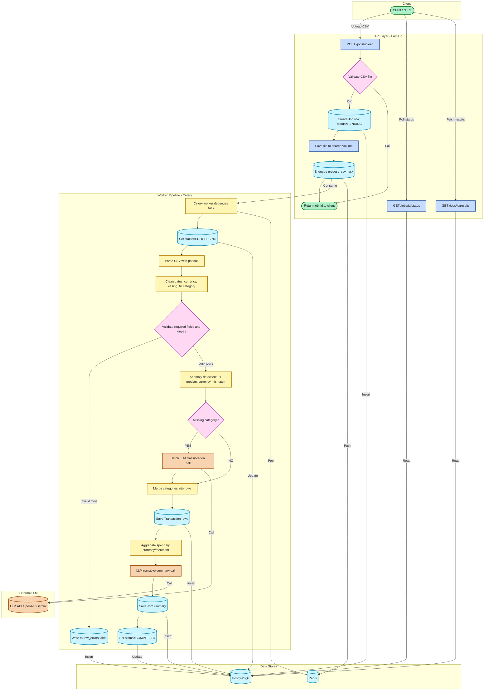

<div align="center">
  
  
  
  <h1>AI Transaction Classifier</h1>
  <p>
    <b>An asynchronous, highly-scalable, AI-powered financial data pipeline.</b>
  </p>

  <p>
    <a href="#-architecture">Architecture</a> •
    <a href="#-data-flow">Data Flow</a> •
    <a href="#-quick-start">Quick Start</a> •
    <a href="#-api-usage">API Usage</a>
  </p>

</div>

<br/>

<div align="center">
  <i>This system robustly ingests, cleans, validates, and classifies raw CSV transaction data using <b>OpenAI's LLMs</b> while strictly guarding against anomalies, duplicates, and missing data.</i>
</div>

---

## 🏗️ Architecture

The system is built on a high-throughput, event-driven microservice architecture designed to handle thousands of transactions without blocking the API thread.

<table>
  <tr>
    <td><b>API Layer</b></td>
    <td><code>FastAPI</code></td>
    <td>Handles high-concurrency incoming HTTP requests instantly.</td>
  </tr>
  <tr>
    <td><b>Message Broker</b></td>
    <td><code>Redis</code></td>
    <td>Intercepts and queues workloads to decouple heavy processing.</td>
  </tr>
  <tr>
    <td><b>Worker Layer</b></td>
    <td><code>Celery</code></td>
    <td>Consumes tasks, manages CSV parsing, validation, and AI network calls.</td>
  </tr>
  <tr>
    <td><b>Database</b></td>
    <td><code>PostgreSQL</code></td>
    <td>Enforces strict relational integrity and persists final audited data.</td>
  </tr>
  <tr>
    <td><b>AI / LLM</b></td>
    <td><code>OpenAI API</code></td>
    <td>Dynamically classifies unknown transactions into standardized categories.</td>
  </tr>
</table>

<h3>Architecture Diagram</h3>



---

## 🔄 Data Flow

<details open>
<summary><b>1. Ingestion</b></summary>
<p>
Users upload a CSV via the API. FastAPI instantly saves it to a shared volume, logs a <code>PENDING</code> job to PostgreSQL, and queues an asynchronous task in Redis.
</p>
</details>

<details open>
<summary><b>2. Parsing & Cleaning</b></summary>
<p>
Celery reads the file safely, strictly forbidding Pandas from generating phantom "nan" artifacts. Dates are standardized to ISO-8601, and currency strings are safely cast to numeric decimals.
</p>
</details>

<details open>
<summary><b>3. Strict Validation</b></summary>
<p>
Missing required fields (like <code>txn_id</code>) and exact duplicates are intercepted. Failures are shunted into a dedicated <code>row_errors</code> table to ensure only 100% clean data advances.
</p>
</details>

<details open>
<summary><b>4. LLM Classification</b></summary>
<p>
Valid rows missing categories are batched and routed to OpenAI. A strict JSON-enforced prompt guarantees accurate classification with robust fallback logic in case of network timeouts or LLM hallucinations.
</p>
</details>

<details open>
<summary><b>5. Anomaly Detection</b></summary>
<p>
Transactions are scrutinized mathematically (amounts exceeding 3x the account's median spend) and logically (domestic merchants charging in USD) and flagged accordingly.
</p>
</details>

<details open>
<summary><b>6. Aggregation & Persistence</b></summary>
<p>
The system calculates total user spend strictly excluding <code>FAILED</code> and <code>PENDING</code> transactions. The entire audited state is atomically committed to PostgreSQL.
</p>
</details>

---


## 📁 Folder Structure

<details open>
<summary><b>Project Worktree</b></summary>
<pre><code>
|-- .dockerignore                            # Excludes files from Docker
|-- .env                                     # Environment variables (DANGER: Excluded)
|-- .gitignore                               # Untracked Git files
|-- Dockerfile.api                           # Docker instructions for FastAPI
|-- Dockerfile.worker                        # Docker instructions for Celery
|-- README.md                                # Main documentation
|-- alembic.ini                              # Database migration config
|-- app                                      # Main application package
|   |-- api                                  # API routing layer
|   |   \-- v1                               # API version 1
|   |       \-- jobs.py                      # Endpoints for job management
|   |-- core                                 # Core configuration
|   |   |-- config.py                        # Pydantic settings
|   |   |-- database.py                      # SQLAlchemy setup
|   |   \-- logging.py                       # JSON logging setup
|   |-- main.py                              # FastAPI entrypoint
|   |-- models                               # SQLAlchemy ORM models
|   |   |-- __init__.py
|   |   |-- base.py                          # Declarative base
|   |   |-- job.py                           # Job tracking table
|   |   |-- job_summary.py                   # Aggregated spend table
|   |   |-- row_error.py                     # Failed transaction table
|   |   \-- transaction.py                   # Cleaned transaction table
|   |-- repositories                         # Database CRUD access
|   |   |-- base.py                          # Declarative base
|   |   |-- job_summaries.py                 # JobSummary queries
|   |   |-- jobs.py                          # Endpoints for job management
|   |   |-- row_errors.py                    # RowError queries
|   |   \-- transactions.py                  # Transaction queries
|   |-- schemas                              # Pydantic schemas
|   |   \-- job.py                           # Job tracking table
|   |-- services                             # Business logic layer
|   |   |-- anomaly_detection_service.py     # Flags anomalies
|   |   |-- cleaning_service.py              # Normalizes data
|   |   |-- csv_parser_service.py            # Parses raw CSVs
|   |   |-- deduplication_service.py         # Finds duplicates
|   |   |-- llm                              # LLM integration layer
|   |   |   |-- classification_service.py    # Manages LLM batching
|   |   |   |-- llm_client.py                # Abstract LLM interface
|   |   |   |-- openai_client.py             # OpenAI implementation
|   |   |   |-- prompt_builder.py            # Constructs LLM prompts
|   |   |   |-- retry_handler.py             # API backoff logic
|   |   |   \-- summary_service.py           # Aggregates metrics
|   |   |-- storage                          # File storage layer
|   |   |   \-- local_storage.py             # Saves local CSVs
|   |   \-- validation_service.py            # Validates fields
|   \-- workers                              # Celery background workers
|       |-- celery_app.py                    # Celery configuration
|       \-- tasks                            # Celery tasks
|           \-- process.py                   # Main pipeline task
|-- architecture.md                          # Architecture notes
|-- dataflow.md                              # Data flow notes
|-- docker-compose.yml                       # Docker orchestration
|-- docs                                     # Documentation folder
|   |-- adr                                  # Architecture records
|   |   |-- 001-use-postgresql.md            # ADR: Database
|   |   |-- 002-use-celery.md                # ADR: Workers
|   |   |-- 003-use-llm-only-for-classification.md # ADR: AI boundary
|   |   \-- 004-use-rowerror-table.md        # ADR: Errors
|   \-- demo_script.md                       # Video script
|-- index.html                               # HTML dashboard
|-- lifecycle.md                             # Lifecycle notes
|-- output_transactions.csv                  # Final output dataset
|-- requirements.txt                         # Python dependencies
|-- run_qa.py                                # QA script
|-- run_real.py                              # Execution script
|-- sample_data                              # Test datasets
|   |-- anomaly.csv                          # Test data
|   |-- dirty.csv                            # Test data
|   |-- duplicates.csv                       # Test data
|   |-- missing_categories.csv               # Test data
|   \-- perfect.csv                          # Test data
|-- system_architecture.md                   # Architecture docs
|-- tests                                    # Test suites
|   |-- integration                          # Integration tests
|   |   \-- test_full_pipeline.py            # End-to-end tests
|   \-- unit                                 # Unit tests
|       |-- test_anomaly_detection_service.py # Logic tests
|       |-- test_cleaning_service.py         # Cleaning tests
|       \-- test_validation_service.py       # Validation tests
\-- transactions.csv                         # Input dataset
</code></pre>
</details>

### Directory Explanations
<table>
<tr><th>Directory</th><th>Purpose</th></tr>
<tr><td><code>app/api/</code></td><td>FastAPI HTTP endpoint definitions and routing.</td></tr>
<tr><td><code>app/core/</code></td><td>System configuration, logging setup, and SQLAlchemy session management.</td></tr>
<tr><td><code>app/models/</code></td><td>PostgreSQL database schema definitions (SQLAlchemy ORM).</td></tr>
<tr><td><code>app/repositories/</code></td><td>Database interaction logic (CRUD operations) separating DB logic from business logic.</td></tr>
<tr><td><code>app/schemas/</code></td><td>Pydantic models for strict API request/response validation.</td></tr>
<tr><td><code>app/services/</code></td><td>Core business logic including CSV Parsing, Data Cleaning, Validation, and OpenAI interactions.</td></tr>
<tr><td><code>app/workers/</code></td><td>Celery configuration and asynchronous background task definitions.</td></tr>
<tr><td><code>docs/</code></td><td>Architecture Decision Records (ADRs) and planning documents.</td></tr>
<tr><td><code>sample_data/</code></td><td>Example CSV files used for testing various pipeline failure states.</td></tr>
<tr><td><code>tests/</code></td><td>Pytest suites covering both unit logic and full integration flows.</td></tr>
</table>

## ⚡ Quick Start

### 1. Configure Environment
Create a `.env` file in the project root and inject your OpenAI key:
```env
OPENAI_API_KEY=your_actual_api_key_here
```

### 2. Boot Docker Services
Spin up the entire microservice stack (FastAPI, Celery, Postgres, Redis):
```bash
docker compose up -d --build
```

---

## 🌐 API Usage

<blockquote>
  <b>Upload a File</b>
</blockquote>

```bash
curl -X POST "http://localhost:8000/jobs/upload" \
  -H "accept: application/json" \
  -H "Content-Type: multipart/form-data" \
  -F "file=@transactions.csv"
```
*Note the `job_id` returned in the JSON payload.*

<br/>

<blockquote>
  <b>Poll Job Status</b>
</blockquote>

```bash
curl -X GET "http://localhost:8000/jobs/{job_id}/status" \
  -H "accept: application/json"
```

<br/>

<blockquote>
  <b>Fetch Final Extracted Results</b>
</blockquote>

```bash
curl -X GET "http://localhost:8000/jobs/{job_id}/results" \
  -H "accept: application/json"
```

---
<div align="center">
  <i>Engineered for enterprise scale.</i>
</div>
